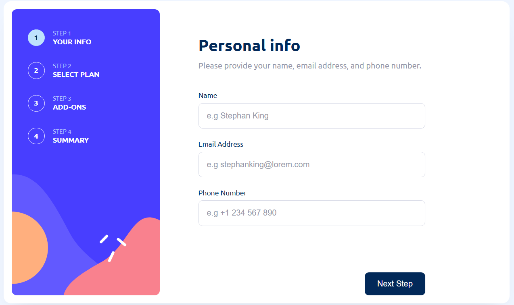
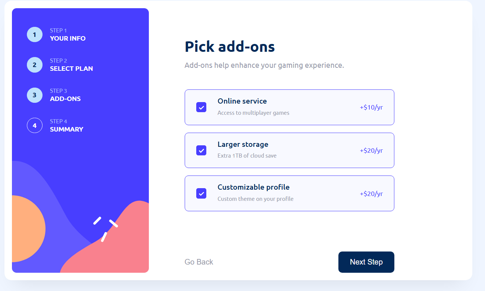
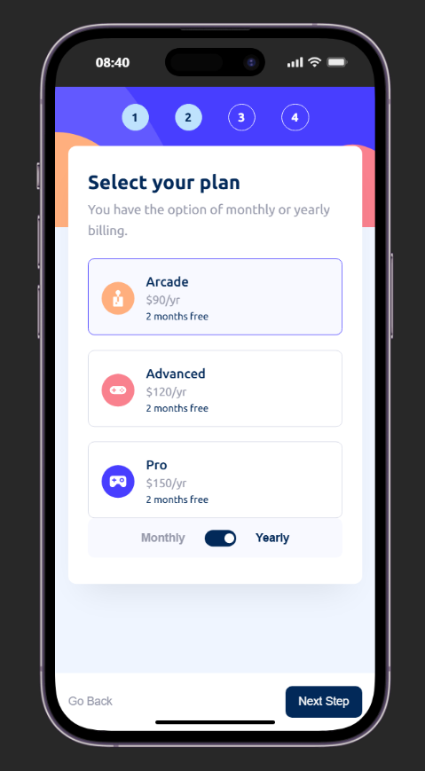
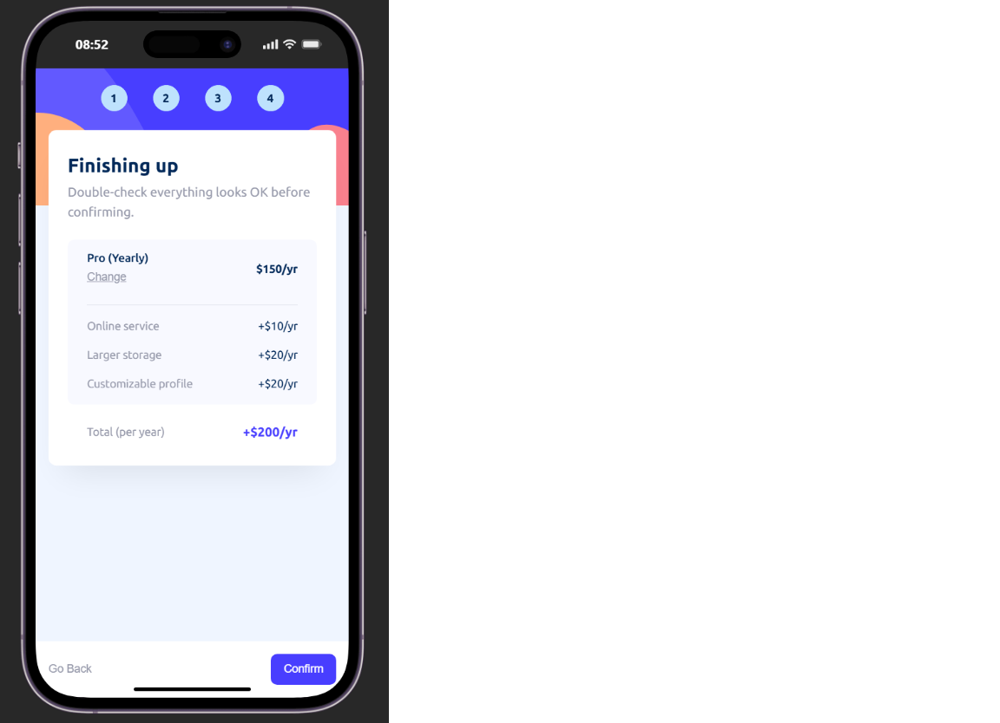
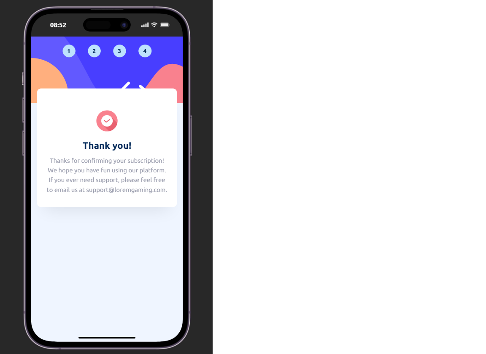

# Multi Step Form
“Multi-step form” Frontend challenge, developed using vanilla HTML, CSS, and JavaScript.

This is a modern, comprehensive, responsive form consisting of multiple tasks, built using HTML, CSS, and JavaScript.
## 🌐 Live Demo
👉 [multi-step-form-mu-sage.vercel.app](https://multi-step-form-mu-sage.vercel.app/)

## 📌 About The Project
It is an online service-style form on a single page. The form is user-friendly and straightforward, consisting of basic personal information, annual and monthly plan options, additional extras, and the total bill.
The project has been developed for both mobile and desktop interfaces.

## ✨ Features

- 4-step form flow (personal information → plan selection → additional services → summary)
- Dynamic price calculation with a monthly/annual billing toggle
- Fully accessible via keyboard (Tab, arrow keys, Space/Enter)
- Responsive design for mobile, tablet, and desktop
- Native form validation (with custom error messages)

## 🛠️ Technologies Used
- HTML5 (semantic markup)
- CSS3 (custom properties, `clamp()`, Grid & Flexbox)
- Git & GitHub
- Vanilla JavaScript
- Vercel

### 💻 Desktop Version

  
  

### 📱 Mobile Version

  
  
  

## 🚀 How to Run It

This project does not require any build tools or dependencies.

1. Clone the repo: `git clone https://github.com/DevCaspiaz/Multi-Step-Form.git`
2. Open the `index.html` file in a browser.

That's it.

## 📝 Notes

- State management is handled via the DOM (e.g., the selected plan is identified by the `.active-plan-card` class). This was a deliberate choice for a small-scale project; if the project were to grow, it would be necessary to switch to a separate data model.
- Plan and add-on selections are built using actual `<input type="radio/checkbox">` elements (visually hidden and styled via labels) — this ensures that keyboard accessibility is natively supported by the browser.

## 🎨 Design Credit

This project's UI design is based on a Figma file I found online; I am not the original designer. This repository only contains my own code implementation, created for practice purposes.
